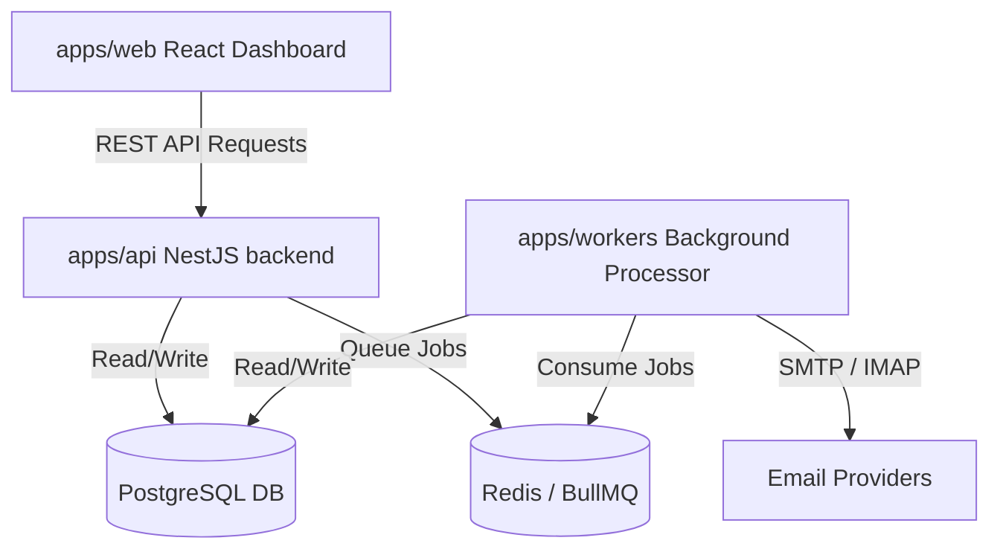

# IndieLeads Enterprise - Code Audit & Architectural Analysis 🚀

A comprehensive analysis of the **IndieLeads Enterprise** codebase, highlighting the system architecture, code design decisions, and critical bugs discovered.

---

## 🏗️ Architecture & Component Mapping

The system is configured as a **Turborepo monorepo** divided into three main operational layers:



### 1. The Face: `apps/web` (React + Vite)
- Exposes a dashboard with modular stats, campaigns, warmup metrics, and a campaign builder.
- Configured with Tailwind CSS, Framer Motion for premium animations, and Recharts for deliverability/placement stats.

### 2. The Brain: `apps/api` (NestJS REST API)
- Serves as the central REST API. Handles workspace membership, authentication, campaign state configuration, and tracking webhooks.
- Orchestrates multi-tenant isolation via a **Prisma Query Extension** that intercepts queries to inject the request's active `workspaceId`.

### 3. The Hands: `apps/workers` (NestJS background processes)
- Operates asynchronous queues via **BullMQ**:
  - `email_sending_queue`: Sends sequenced emails, rewrites links for click tracking, and appends 1x1 open tracking pixels.
  - `reply_fetch_queue`: Periodically pulls emails via IMAP, parsed using `mailparser` and classified using Google Gemini.
  - `warmup_queue`: Simulates human-to-human interaction within the inbox pool to build sender domain reputation scores.
  - `campaign_sequencing_queue`: Scans active leads, checks delay constraints, and schedules the next sequencing steps.

---

## 🔍 Critical Findings & System Bugs

We performed a thorough static analysis of the database layer, background workers, and business logic. Below are the **critical bugs** that will cause runtime crashes or database failures.

### 🔴 1. Broken Tenant-Isolation Extension (Critical / System-Wide Crash)
* **Location:** [`apps/api/src/modules/prisma/prisma.service.ts`](file:///C:/Users/h/.gemini/antigravity/scratch/IndieLeads-main/apps/api/src/modules/prisma/prisma.service.ts#L31-L83)

#### The Problem:
The query extension attempts to inject `workspaceId` automatically into all read/write queries:
```typescript
if (['findFirst', 'findMany', 'findUnique', 'count', 'update', 'delete', 'updateMany', 'deleteMany'].includes(operation)) {
  const anyArgs = args as any || {};
  anyArgs.where = { ...anyArgs.where, workspaceId };
}
```
In Prisma, **`findUnique`**, **`update`**, and **`delete`** operations strictly require that the `where` clause contains only unique columns or composite unique keys (like `@id` or `@unique`).
Because `workspaceId` is **not** defined as a composite unique key (e.g., `@@unique([id, workspaceId])`) on any model in `schema.prisma`, Prisma will throw a validation error at runtime:
```
Unknown arg 'workspaceId' in where for type CampaignWhereUniqueInput.
```
This breaks **every single** read/write/delete query executed on tenant-scoped models in the REST API request context.

Additionally, developers manually attempted to pass `workspaceId` to deletes in two files:
- **Leads Service:** [`leads.service.ts`](file:///C:/Users/h/.gemini/antigravity/scratch/IndieLeads-main/apps/api/src/modules/leads/leads.service.ts#L177)
  ```typescript
  return this.prisma.lead.delete({ where: { id, workspaceId } }); // Runtime Error
  ```
- **Campaigns Service:** [`campaigns.service.ts`](file:///C:/Users/h/.gemini/antigravity/scratch/IndieLeads-main/apps/api/src/modules/campaigns/campaigns.service.ts#L130)
  ```typescript
  return this.prisma.campaign.delete({ where: { id, workspaceId } }); // Runtime Error
  ```

#### The Fix:
Modify the Prisma query extension to handle unique/write operations securely by checking the record ownership beforehand rather than appending parameters to `where`:
```typescript
// 1. Convert findUnique into findFirst (which allows non-unique filters)
if (operation === 'findUnique') {
  return (this._rawClient as any)[model].findFirst({
    ...args,
    where: { ...args.where, workspaceId },
  });
}

// 2. Pre-verify ownership for update and delete before executing
if (operation === 'update' || operation === 'delete') {
  const anyArgs = args as any || {};
  const record = await (this._rawClient as any)[model].findFirst({
    where: { id: anyArgs.where.id, workspaceId },
    select: { id: true },
  });
  if (!record) {
    throw new NotFoundException(`Record not found in the active workspace.`);
  }
}
```
For the manual deletes, strip `workspaceId` from the `.delete()` call since the extension will already guard it.

---

### 🔴 2. Missing `TrackingLog` Database Model (Critical / Pipeline Breaker)
* **Location:** [`apps/api/src/modules/tracking/tracking.service.ts`](file:///C:/Users/h/.gemini/antigravity/scratch/IndieLeads-main/apps/api/src/modules/tracking/tracking.service.ts#L33) & [`schema.prisma`](file:///C:/Users/h/.gemini/antigravity/scratch/IndieLeads-main/prisma/schema.prisma)

#### The Problem:
When processing link clicks and email open tracking pixels, the service runs:
```typescript
await (this.prisma as any).$transaction([
  (this.prisma as any).trackingLog.create({
    data: { ... }
  }),
  ...
]);
```
However, the `TrackingLog` model is **never defined** inside `schema.prisma`. As a result, the `trackingLog` client object is undefined, causing a runtime crash when a lead opens a tracked email or clicks a link.

#### The Fix:
Add the `TrackingLog` model to `schema.prisma`:
```prisma
model TrackingLog {
  id          String    @id @default(uuid())
  workspaceId String
  leadId      String
  campaignId  String
  logId       String
  type        String    // open, click
  ipAddress   String?
  userAgent   String?
  createdAt   DateTime  @default(now())
  
  workspace   Workspace @relation(fields: [workspaceId], references: [id])
  @@index([workspaceId])
  @@index([campaignId])
  @@index([logId])
}
```

---

### 🟡 3. Node.js-Only Library in Web Frontend (Minor / Bloat)
* **Location:** [`apps/web/package.json`](file:///C:/Users/h/.gemini/antigravity/scratch/IndieLeads-main/apps/web/package.json#L16)

#### The Problem:
`apps/web/package.json` declares `"nodemailer": "8.0.1"` under its web-app dependencies. Nodemailer is a backend library requiring Node.js core modules (`net`, `tls`, `fs`) and cannot compile or run inside the web browser. While it isn't currently imported anywhere in `apps/web/src`, it increases dependency complexity.

#### The Fix:
Remove `"nodemailer"` from `apps/web/package.json`.

---

## 🚀 Architectural Design Strengths

Despite the bugs, the project exhibits several excellent architectural choices:
1. **Asynchronous Processing (BullMQ/Redis):** Email transmission, replies, and sequencing are decoupled from request-response cycles. If a mail server is slow or rate-limited, the API remains snappy.
2. **Robust Content Personalization:** The templates support custom merge fields (`{{firstName}}`, `{{company}}`, domain parsing, etc.) with safe fallbacks.
3. **Smart Inbox Rotation (Round-Robin):** Inboxes are selected dynamically by checking send volumes for the current day to balance traffic evenly.
4. **Security & Context Isolation:** `JwtAuthGuard` and `TenantContext` use Node's `AsyncLocalStorage` to bubble workspace contexts cleanly without parameter pollution in deep call stacks.
